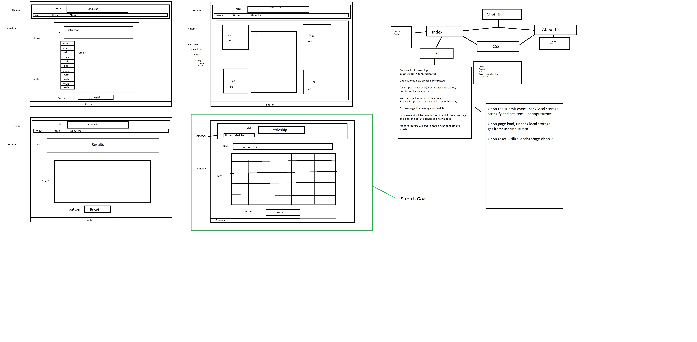

# Witty-Mad-Libs by Bert Carlos Jordan Jeffrey

## Project Overview

### Ad Lib

1.We take random sentences or paragraphs that we make and allow the user to input specific types of words, ex. Nouns, Adjective, Verbs, to fill in premade blanks in the sentences to create a funny story, poem, songs, rhymes, etc. The type of output can be selected by category using additional linked pages, or simplify it further by having all the options on one page.

2.It’s humorous and entertaining. It will relieve a one of the greatest catastrophes humankind has faced… boredom.

3.MVP – It needs to generate a limerick with random words inputted by user.

> Stretch goal

### Battle Ship

1.User clicks on a square and if that square contains a “ship” then it sinks. Squares will be spread out  in groups inside a grid to simulate ships. If you click on all the squares containing ships within a set amount of turns, you win.

2.It’s a game to have fun with. Kids should find it fun. And there’s nothing quite like winning a game.  Winning is cool.

3.You need a winning or losing condition to occur. Winning occurs if you click on predetermined sections of a grid before clicks run out. Losing occurs if you run out of clicks.

## Wireframes

1.INSERT IMAGES

## User Stories

1.I as the *user* wants to be entertained to escape reality

2.I as the *user* wants the site to be simple so not to be frustrated

3.I as the *client* wants the website to be accessible by all potential users achieving accessibility standards.

4.I as the *client* wants the website to be replayable to encourage repeat traffic

5.I as the *client* wants there to be enough space on the website to display ads for revenue.

## Links and Resources

[Trello Project Manager](https://trello.com/b/Sqy20qrE/madlib)

[Liz Krane the LearningNerd at LearnTeachCode](https://github.com/LearnTeachCode/Battleship-JavaScript)

## Acknowledgements

Big thanks to Shayla and Michael for their invaluable input! Couldn't have done it without you!

